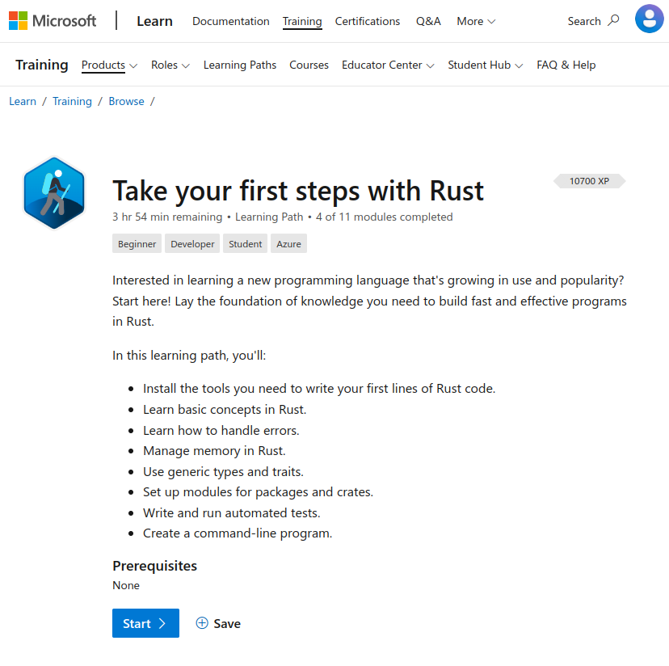

# README

This repository contains some of my exercises for the learning path [Take your first steps with Rust](https://learn.microsoft.com/en-us/training/paths/rust-first-steps/) available in Microsoft Learn.

This learning path is part of these two Microsoft Cloud Challenges:

- [Crack code interview problems in Rust series Challenge](https://learn.microsoft.com/en-us/training/challenges?id=4f770435-7089-4966-b690-7306844339cd).
- [Primeros pasos con Rust](https://learn.microsoft.com/en-us/training/challenges?id=43b38ec1-80f0-454b-817b-1afefe59736b) (Spanish).

These exercises were done using Rust +1.66, Ubuntu Linux 22.04 and Visual Studio Code.

## License

[MIT](https://choosealicense.com/licenses/mit/)
